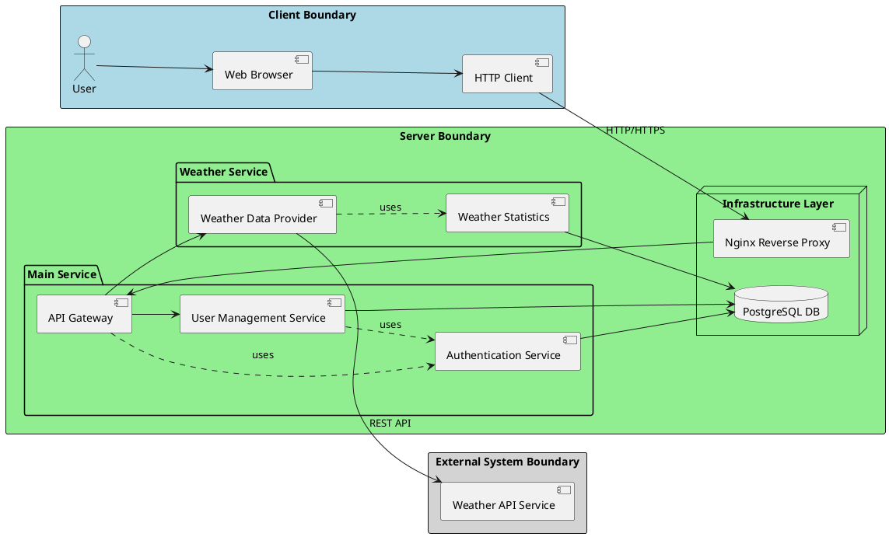

# HTTP Server Python

## Overview
This project is a simple HTTP server implemented in Python with a weather service microservice architecture. It handles user management and weather information requests.

## Requirements
- Docker and Docker Compose
- Python 3.9+ (for local development)

## Quick Start with Docker
Start the services:
```bash
docker-compose up --build
```

## Available Endpoints

### Main Web Service (http://localhost/)
- `GET /` - API documentation
- `GET /users` - List all users
- `POST /user` - Create new user
- `GET /user/{id}` - Get user by ID
- `PUT /user/{id}` - Update user
- `DELETE /user/{id}` - Delete user
- `GET /weather?city={city}` - Get weather for city (via web service)

### Weather Service (http://localhost/api/weather)
- `GET /api/weather?city={city}` - Get weather for city (direct microservice access)

## Local Development
To install dependencies and run locally:
```bash
pip install -r requirements.txt
python server.py
```

## Architecture
- Nginx: Reverse proxy (Port 80)
- Web Service: User management and routing (Port 5000)
- Weather Service: Weather data microservice (Port 5001)

